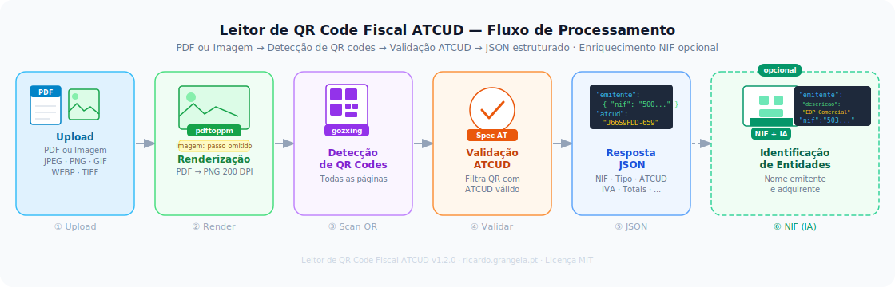

# Leitor de QR Code Fiscal ATCUD

**Versão:** 1.0.0 · **Licença:** MIT · **Autor:** [Ricardo Grangeia](https://ricardo.grangeia.pt)

Serviço HTTP escrito em Go para leitura e descodificação de **QR codes ATCUD** em documentos fiscais portugueses. Extrai o NIF do emitente, NIF do adquirente, tipo de documento, linhas de IVA por taxa e região fiscal, totais e muito mais — tudo em JSON estruturado.

---

## Funcionalidades

- Recebe um ficheiro **PDF** por HTTP (multipart/form-data)
- Detecta e descodifica **todos os QR codes** em todas as páginas
- Filtra os que contêm um código **ATCUD** válido (especificação AT)
- Devolve JSON com os dados em bruto (`/scan`) ou totalmente estruturados (`/parse`)
- Interface web integrada em português de Portugal
- Documentação interactiva **OpenAPI 3.1** via Swagger UI
- Pronto para Docker e Portainer

---

## Infográfico



---

## Arquitectura

O projecto segue uma arquitectura **DDD simplificada**:

```
cmd/
  go_api/
    main.go                    ← ponto de entrada

internal/
  config/                      ← variáveis de ambiente
  domain/document/             ← entidades e regras de negócio
    qrcode.go                  ← entidade QRCode
    atcud.go                   ← detecção de ATCUD (regex)
    parsed_qrcode.go           ← documento fiscal estruturado
    qrcode_parser.go           ← parser dos campos do QR (spec AT)
  application/document/        ← casos de uso
    service.go                 ← ScanPDF e ParsePDF
  infrastructure/pdf/          ← adaptadores externos
    renderer.go                ← renderização de páginas (pdftoppm)
    scanner.go                 ← detecção de QR codes (gozxing)
  interfaces/http/             ← camada HTTP
    handler.go                 ← handlers Huma
    router.go                  ← rotas e configuração
  ui/                          ← interface web embutida
    embed.go
    index.html
```

---

## Endpoints da API

| Método | Caminho | Descrição |
|--------|---------|-----------|
| `POST` | `/api/v1/document/scan` | Devolve o conteúdo bruto dos QR codes com ATCUD |
| `POST` | `/api/v1/document/parse` | Devolve os dados fiscais completamente estruturados |
| `GET`  | `/api/v1/version` | Versão, data de actualização e autor |
| `GET`  | `/health` | Estado do serviço |
| `GET`  | `/docs` | Swagger UI (OpenAPI 3.1) |
| `GET`  | `/` | Interface web |

### Exemplo de resposta — `/api/v1/document/parse`

```json
{
  "total_qr_codes": 1,
  "parsed_count": 1,
  "documents": [
    {
      "numero_pagina": 1,
      "conteudo_bruto": "A:508136695*B:999999990*C:PT*D:FT*E:N*F:20250917*G:FT 2025A/341*H:KXTP8ZQ2-341*I1:PT*I7:142.68*I8:32.82*N:32.82*O:175.50*Q:pNaK*R:1287",
      "emitente": { "nif": "508136695" },
      "adquirente": { "nif": "999999990", "pais": "PT" },
      "documento": {
        "tipo_codigo": "FT",
        "tipo": "Fatura",
        "estado_codigo": "N",
        "estado": "Normal",
        "data": "2025-09-17",
        "identificador": "FT 2025A/341",
        "atcud": "KXTP8ZQ2-341"
      },
      "impostos": {
        "linhas": [
          {
            "regiao": "Portugal Continental",
            "taxa": "Taxa Normal",
            "base_tributavel": 142.68,
            "valor_iva": 32.82
          }
        ],
        "total_imposto": 32.82,
        "retencao_fonte": 0
      },
      "totais": { "total_documento": 175.50 },
      "caracteres_assinatura": "pNaK",
      "numero_certificado": "1287",
      "informacoes_adicionais": ""
    }
  ]
}
```

---

## Como executar localmente

### Pré-requisitos

- [Docker Desktop](https://www.docker.com/products/docker-desktop/)
- Git

### 1. Clonar o repositório

```bash
git clone <url-do-repositório>
cd GoApi
```

### 2. Configurar variáveis de ambiente

Copiar o ficheiro de exemplo e ajustar os valores:

```bash
cp .env.example .env
```

| Variável | Descrição | Valor por omissão |
|----------|-----------|-------------------|
| `PORT` | Porta HTTP do servidor | `8080` |
| `VLLM_BASE_URL` | URL base do serviço vLLM | `http://vllm:8000/v1` |
| `VLLM_API_KEY` | Chave de autenticação vLLM | — |
| `VLLM_MODEL` | Modelo vLLM a utilizar | `Qwen/Qwen2.5-7B-Instruct-AWQ` |

### 3. Construir e executar

```bash
docker build -t go-api-app .

docker run --rm -p 8080:8080 \
  -e PORT=8080 \
  -e VLLM_BASE_URL=http://localhost:8000/v1 \
  -e VLLM_API_KEY=teste \
  go-api-app
```

> **PowerShell:** substituir `\` por `` ` ``

### 4. Abrir no browser

| URL | O que abre |
|-----|-----------|
| http://localhost:8080/ | Interface web |
| http://localhost:8080/docs | Swagger UI |
| http://localhost:8080/openapi.json | Especificação OAS 3.1 |

---

## Implementação no Portainer

O `docker-compose.yml` usa variáveis de ambiente explícitas, compatíveis com a secção **Environment variables** do Portainer.

1. No Portainer, criar uma nova **Stack**
2. Colar o conteúdo do `docker-compose.yml`
3. Na secção **Environment variables**, preencher os valores
4. Clicar em **Deploy the stack**

---

## Tecnologias utilizadas

| Componente | Tecnologia |
|-----------|-----------|
| Linguagem | [Go 1.25](https://go.dev/) |
| Framework HTTP | [Gin](https://gin-gonic.com/) |
| OpenAPI / Swagger | [Huma v2](https://huma.rocks/) — OAS 3.1 automático |
| Detecção de QR codes | [gozxing](https://github.com/makiuchi-d/gozxing) |
| Renderização de PDF | [poppler-utils](https://poppler.freedesktop.org/) (`pdftoppm`) |
| Interface web | HTML + Tailwind CSS + Vanilla JS |
| Containerização | Docker / Docker Compose |

---

## Licença

Distribuído sob a licença **MIT**. Consulte o ficheiro [LICENSE](LICENSE) para mais informações.

---

## Autor

**Ricardo Grangeia** — [https://ricardo.grangeia.pt](https://ricardo.grangeia.pt)
